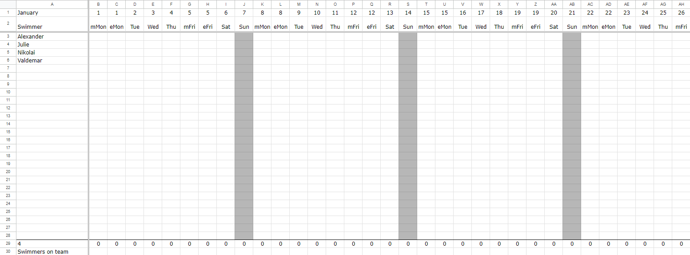
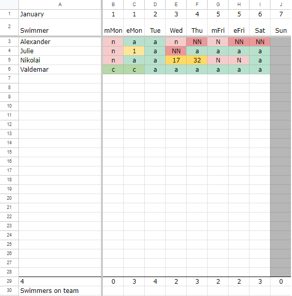
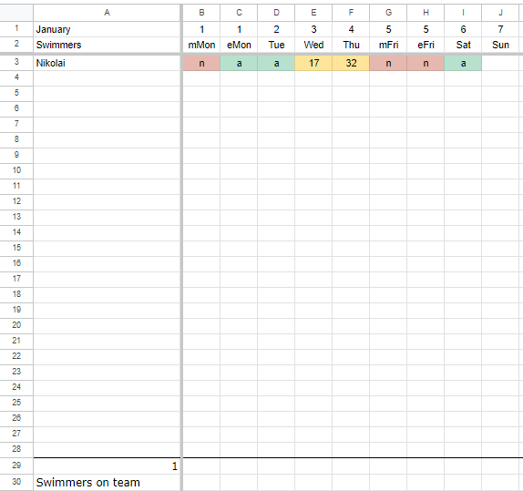
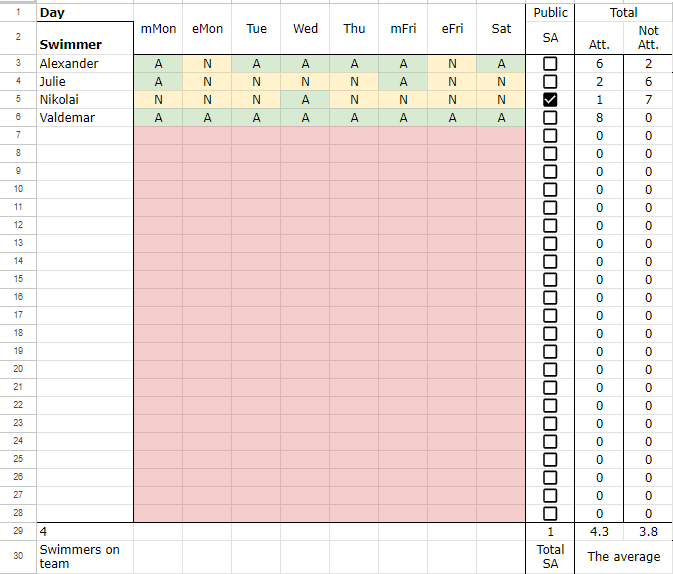

# AttenanceGoogleSheet

## Guides 

### Usage

This attendance file enables the possibility to share attendance with external actors. This is done completely automatically. The coaches only have to document the attendance in the primary file [primary file](https://docs.google.com/spreadsheets/d/1OtppC-XNCi8MA6iUPs1loCO9HAkhDDPMWZ1DQCfl1p8/edit#gid=1329891054). The shared file or [secondary file](https://docs.google.com/spreadsheets/d/1Jb85q1J6Bnr2BeGMfUAGhJOP5TbKaStClVaDnXB1_NQ/edit#gid=1762417855) is then updated based on the configuration in the schedule sheet [Guide to Configure](#seasonal).
 
After setting up the current month, the sheet is ready to use [Preparing sheet for new month](#monthly).

The following different indicators can be inserted within the document: 

| Definition | Mark |
|-----------------|-----------------|
| Attending | A  |
| Not Attending  | N  |
| Not Attending & No notice | NN  |
| Attending Competition | C |
| Latency in mins | Numeric value |

An example of this could be like: 

Within the secondary document, the attendance is automatically shared, based on the configuration. This example shows that only one attendee has enabled the sharing. 

### Preparation

There are two kinds of preparation, monthly and seasonal. Monthly is just setting up the attendance schema for the current month. Seasonal is setting up the training structure, the team structure, and the attendees' expected training days.  

#### ***Monthly***
  1. Go to the ***template*** sheet.
  2. Click on the **Generate New Sheet** button & enter the name of the sheet. 
  3. Go to the newly created sheet. 
  4. Choose the month (default at **X35**).
  5. Choose the first day of the month (default at **X36**). 
  6. Manually add duplicate dates for the days with morning training, at **row 1**.
  7. Click on the **Approve Layout** button. 
     > **IMPORTANT**: ensure that the layout is correct before using the sheet. 

#### ***Seasonal***
The first step is setting up the schedule for the swimmers' expected attendance during the week. 

  1. Go to the ***swimmer_schedule*** sheet.
  2. Insert the swimmers in **column A**.
  3. Change the days that training occurs on **row 2**. 
      > The day must use these abbreviations: *Mon*, *Tue*, *Wed*, *Thu*, *Fri*, *Sat*, or *Sun*.
      >> Days with multiple trainings are added separately, with a ***m*** or ***e*** indicator for *morning* or *evening* training. 
  4. Mark the Sports Academy swimmers with a checkmark in **column J**. This ensures that their attendances are shared within the secondary file.
  5. Insert the expected days for the attendees.   
         > ***A*** for expected to attend. **N** for expected to NOT attend. 
  6. Click on the **Update SA Swimmers** button to verify which swimmers' attendance is shared in other documents. 

The result will look somewhat like this: 
  
